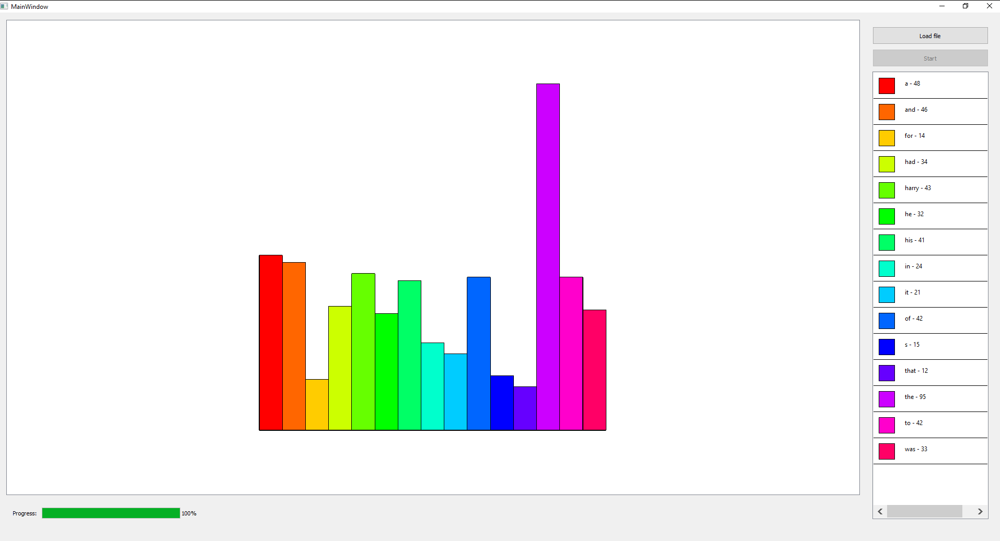

Построитель гистограммы слов из файла произвольного размера.

Показывает топ-15 слов в файле без учёта окончаний (например слова "Колбаса", "Колбаска", "Колбаски", "Колбасидзе" будут считаться разными).
Для парсинга используется простое регулярное выражение QRegExp("\\W+") в ProcessManager.cpp.

Пример гистограммы:

Используется простая отрисовка в области размером 600x600.

Значение, которое встречается наибольшее число раз на текущий момент времени будет высотой 600, остальные пропорционально ниже.
Справа показана легенда: "цвет слово-частота", где частота - это число, показывающее сколько раз встречалось слоов в тексте на данный момент времени.